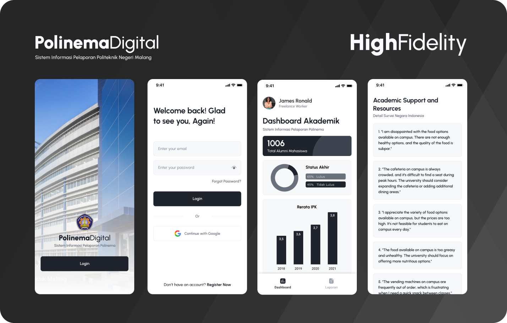
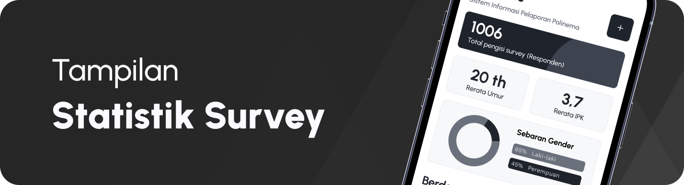

#  ✨ PolinemaDigital - Kelompok 4

##
## 🧑‍💻 Informasi Anggota Kelompok
1. Fitrah Rahmadhani Ahmad (2141762092) sebagai UI/UX Designer
   - akun github: https://github.com/fitrahRahmadhani
2. Halim Teguh Saputro (2141762122) sebagai Front-End Developer (Flutter) 
   - akun github: https://github.com/HalimTeguh
3. M. Ilham Maulidin (2141762087) sebagai Back-End Developer (Laravel)
   - akun github: https://github.com/Maulidin-Ilham
5. Nabila Rasyidah (2141762047) sebagai Dokumentalis
   - akun github: https://github.com/nabilarasyidah

 

#
# ❓ The Brief…

Pendidikan tinggi memainkan peran penting dalam perkembangan pribadi dan profesional mahasiswa. Beberapa aspek kunci dari pendidikan tinggi adalah kualitas layanan yang diberikan oleh institusi pendidikan serta monitoring terhadap dinamika akademik yang terjadi. Institusi tersebut bertanggung jawab untuk menyediakan lingkungan yang mendukung pembelajaran dan perkembangan mahasiswa.

Mr. X adalah seorang administrator atau staf di Politeknik Negeri Malang yang berkomitmen untuk meningkatkan kualitas layanan yang disediakan kepada mahasiswa. Untuk mencapai tujuan ini, dia merasa perlu untuk mendapatkan masukan dari para mahasiswa mengenai pengalaman mereka di kampus. Selain itu, dia juga perlu melakukan monitoring terhadap nilai mahasiswa serta angka kelulusan di tiap tahunnya.

Mr. X memutuskan untuk menggunakan aplikasi mobile sebagai alat mengelola data akademik serta data hasil survey. Dengan memanfaatkan aplikasi mobile, data mentah akan dikumpulkan dengan lebih efisien dan akurat, dan visualisasinya akan membantu memandu langkah-langkah selanjutnya dalam upaya meningkatkan kualitas layanan pendidikan dan aspek pendukung di kampus.

 

#
# 🤔 What makes a good App?
Karena setiap dashboard visualisasi data biasanya dibuat dengan tujuan tertentu, seperti menyajikan data survei kepada pemangku kepentingan atau menginformasikan keputusan berdasarkan data, maka kesuksesannya sangat bergantung pada seberapa informatif dan efektif desain yang kita buat.

Berikut ini adalah beberapa poin penting yang harus di perhatikan ketika membuat sebuah desain dashboard aplikasi mobile:
- Desain harus sederhana dan mudah dimengerti. Jangan tumpahkan terlalu banyak informasi pada satu layar, hindari kebingungan dengan pengguna.
- Gunakan grafik dan tabel dengan. Pastikan visualisasi data memudahkan pemahaman.
- Adanya fitur filtering, sehingga pengguna dapat menjelajahi data dengan lebih baik.
- Prioritaskan Data Utama: Soroti data yang paling penting atau relevan untuk tujuan survei Anda. Ini memungkinkan pengguna untuk segera melihat poin-poin kunci.
- Warna dan Kontras: Gunakan warna dengan kontras yang cukup sehingga data mudah terbaca. Perhatikan penggunaan warna yang
- Sertakan legenda atau keterangan yang menjelaskan makna elemen-elemen dalam dashboard. Ini membantu pengguna yang tidak akrab dengan data tersebut.

 

#
# ⚽ The Goals
Setidaknya ada 2 goal yang harus dicapai pada pembangunan aplikasi ini:
1. Business Goal
Aplikasi ini bertujuan untuk memberikan pemangku kepentingan (seperti manajemen, fakultas, atau staf administrasi) aplikasi dapat digunakan untuk membuat keputusan strategis yang didasarkan pada data akademik dan  survei, yang pada akhirnya akan meningkatkan kualitas layanan dan kompentensi mahasiswa.
2. Conversion Goal
Jika tujuan utama adalah meningkatkan jumlah mahasiswa (asumsikan peningkatan daya jual kampus), conversion goal bisa mencakup berapa banyak mahasiswa yang tetap di Politeknik Negeri Malang dan berapa peningkatan mahasiswa baru setelah perubahan yang diimplementasikan berdasarkan temuan.

 

#
# 🧩 User Flow

Penjelasan userflow di atas adalah sebagai berikut
1. Pengguna membuka aplikasi.
2. Setelah membuka aplikasi, pengguna dihadapkan pada pilihan. Mereka dapat memilih untuk login menggunakan email atau dengan akun Gmail yang ada.
3. Setelah memilih metode login yang sesuai, sistem mengarahkan pengguna ke halaman beranda. Terdapat dua navigation, yaitu Dashboard akademik dan Laporan hasil survei
4. Di halaman Dashboard akademik, pengguna dapat melihat informasi total alumni, diagram pie status akhir, serta diagram batang rerata IPK pertahun.
5. Kemudian user menekan tab Laporan survei. Sistem menampilkan berbagai informasi survei. Kemudian user menambahkan data survei
6. Sistem menampilkan form dan meminta user memasukkan data yang diperlukan.
7. User menekan tombol Simpan, dan sistem menyimpan penambahan data baru.
8. UserFlow lain: lapor pelecehan, lihat detail survei, edit data survei

 

#
# 🧪 Let’s start: Low Fidelity (Lo-Fi)

Low-fi (low-fidelity) prototipe dari aplikasi di atas adalah versi awal yang sederhana dan kurang rinci dari aplikasi tersebut

 

# 🎴 Favorite part, High Fidelity! (Hi-Fi)

Dalam versi "high-fidelity" ini, aplikasi telah dirancang dengan sangat baik dengan elemen-elemen visual yang menarik, antarmuka pengguna yang mudah digunakan, dan detail-detail interaktif yang mempermudah navigasi dan pengambilan keputusan pengguna. Ini menciptakan pengalaman pengguna yang lebih imersif dan menarik.

 

#
# 😎🔥 Developer Time

Welcome Screen menampilkan latar belakang gedung Politeknik Negeri Malang disertai logo dan sedikit deskripsi. Kemudian di bawahnya terdapat tombol Login untuk meneruskan penjelajahan ke halaman berikutnya.

 

Pengguna membuka aplikasi dengan antarmuka yang modern dan menarik. Mereka langsung melihat pilihan untuk login menggunakan email atau akun Gmail

 

Halaman Dashboard menampilkan informasi terkait total alumni mahasiswa, status akhir, dan grafik rerata IPK tiap tahunnya.

 

Pada halaman Laporan statistik survey, terdapat dua section yakni "Statistik" dan "Berdasarkan Negara".

Section "Statistik" menampilkan informasi terkait total pengisi survey (responden), rerata umur, rerata ipk, dan sebaran jenis kelamin. Selain itu, terdapat button untuk menambahkan data survey.

Pada section "Berdasarkan Negara" pengguna dapat dengan mudah memilih negara yang ingin mereka respon melalui menu drop-down yang interaktif. Sebelum memilih negera, maka menampilkan informasi jumlah respon tiap genre secara keseluruhan.
Setelah memilih negara, sistem menampilkan informasi survei pada negara tersebut diertai jumlah respon tiap topiknya. Pengguna dapat menekan card ini untuk mendapatkan informasi lebih detail.

Pengguna dapat melakukan pelaporan pelecehan dengan menekan button "Lapor Pelecehan".

 

Ketika pengguna menekan tombol "+" atau "Lapor Pelecehan", maka sistem akan menampilkan form yang terdiri dari beberapa field yang harus diisi.

 

Setelah pengguna memilih topik permasalahan yang ingin ditinjau, sistem menampilkan uraian detail tiap record genre terpilih sesuai negara yang telah dipilih sebelumnya.

 

#
# 📸 Our Documentation

