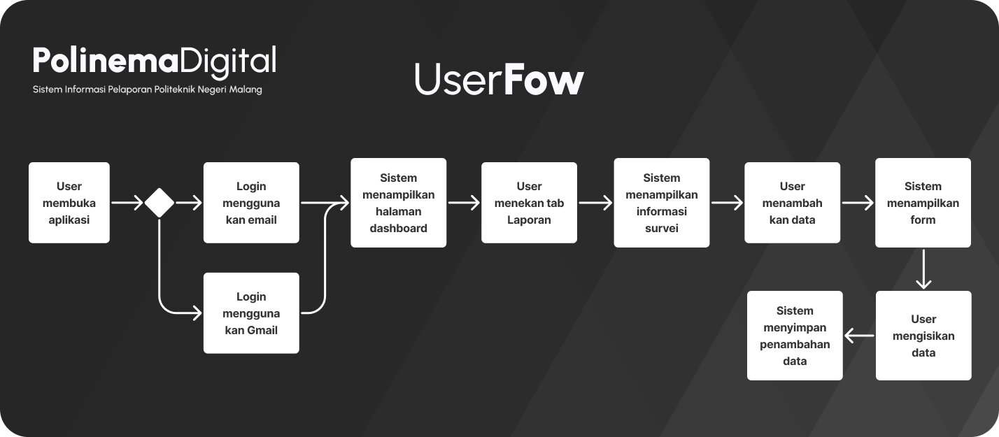

#  ✨ PolinemaDigital - Kelompok 4

##
## 🧑‍💻 Informasi Anggota Kelompok
1. Fitrah Rahmadhani Ahmad (2141762092) sebagai UI/UX Designer
   - akun github: https://github.com/fitrahRahmadhani
2. Halim Teguh Saputro (2141762122) sebagai Front-End Developer (Flutter) 
   - akun github: https://github.com/HalimTeguh
3. M. Ilham Maulidin (2141762087) sebagai Back-End Developer (Laravel)
   - akun github: https://github.com/Maulidin-Ilham
5. Nabila Rasyidah (2141762047) sebagai Dokumentasi
   - akun github: https://github.com/nabilarasyidah

 

#
# ❓ The Brief…

Pendidikan tinggi memainkan peran penting dalam perkembangan pribadi dan profesional mahasiswa. Salah satu aspek kunci dari pendidikan tinggi adalah kualitas layanan yang diberikan oleh institusi pendidikan. Institusi tersebut bertanggung jawab untuk menyediakan lingkungan yang mendukung pembelajaran dan perkembangan mahasiswa.

Mr. X adalah seorang administrator atau staf di Politeknik Negeri Malang yang berkomitmen untuk meningkatkan kualitas layanan yang disediakan kepada mahasiswa. Untuk mencapai tujuan ini, dia merasa perlu untuk mendapatkan masukan dari para mahasiswa mengenai pengalaman mereka di kampus. Oleh karena itu, dia memutuskan untuk melakukan survei yang berfokus pada masalah komplain yang mungkin dihadapi oleh mahasiswa.

Survei ini difokuskan pada mahasiswa kelas Internasional, karena mereka mungkin memiliki perspektif yang berbeda atau kebutuhan khusus dalam hal sumberdaya akademik, dukungan, dan layanan lainnya. Melalui pengumpulan data dari partisipan survei ini, Mr. X berharap untuk memahami masalah yang mungkin dihadapi mahasiswa kelas Internasional dan mencari solusi untuk meningkatkan kualitas layanan.

Survey ini mencakup tiga faktor utama yang menjadi perhatian, yaitu Sumberdaya dan Dukungan Akademik (Academic Support and Resources), Layanan Kantin dan Makanan (Food and Cantines), dan faktor "lainnya" yang mungkin mencakup berbagai masalah yang tidak termasuk dalam dua kategori utama tersebut. Data yang dikumpulkan dari survei ini akan memberikan wawasan awal tentang masalah yang perlu ditangani dan area di mana perbaikan diperlukan.

Mr. X memutuskan untuk menggunakan aplikasi mobile sebagai alat untuk melakukan survei ini karena kepraktisan dan keterjangkauan teknologi ini. Dengan memanfaatkan aplikasi mobile, data mentah akan dikumpulkan dengan lebih efisien dan akurat, dan hasil survei ini akan membantu memandu langkah-langkah selanjutnya dalam upaya meningkatkan kualitas layanan pendidikan dan aspek pendukung di kampus.

 

#
# 🤔 What makes a good App?
Karena setiap dashboard data hasil survei biasanya dibuat dengan tujuan tertentu, seperti menyajikan data survei kepada pemangku kepentingan atau menginformasikan keputusan berdasarkan data, maka kesuksesannya sangat bergantung pada seberapa informatif dan efektif desain yang kita buat.

Berikut ini adalah beberapa poin penting yang harus di perhatikan ketika membuat sebuah desain dashboard aplikasi mobile:
- Desain harus sederhana dan mudah dimengerti. Jangan tumpahkan terlalu banyak informasi pada satu layar, hindari kebingungan dengan pengguna.
- Gunakan grafik dan tabel dengan. Pastikan visualisasi data memudahkan pemahaman.
- Adanya fitur filtering, sehingga pengguna dapat menjelajahi data dengan lebih baik.
- Prioritaskan Data Utama: Soroti data yang paling penting atau relevan untuk tujuan survei Anda. Ini memungkinkan pengguna untuk segera melihat poin-poin kunci.
- Warna dan Kontras: Gunakan warna dengan kontras yang cukup sehingga data mudah terbaca. Perhatikan penggunaan warna yang
- Sertakan legenda atau keterangan yang menjelaskan makna elemen-elemen dalam dashboard. Ini membantu pengguna yang tidak akrab dengan data tersebut.

 

#
# ⚽ The Goals
Setidaknya ada 2 goal yang harus dicapai pada pembangunan aplikasi ini:
1. Business Goal
Aplikasi ini bertujuan untuk memberikan pemangku kepentingan (seperti manajemen, fakultas, atau staf administrasi) alat yang dapat digunakan untuk membuat keputusan strategis yang didasarkan pada data survei, yang pada gilirannya akan meningkatkan kualitas layanan dan pengalaman mahasiswa.
2. Conversion Goal
Jika tujuan utama adalah meningkatkan jumlah mahasiswa (asumsikan peningkatan daya jual kampus), conversion goal bisa mencakup berapa banyak mahasiswa yang tetap di Politeknik Negeri Malang dan berapa peningkatan mahasiswa baru setelah perubahan yang diimplementasikan berdasarkan temuan survei.

 

#
# 🧩 User Flow

Penjelasan userflow di atas adalah sebagai berikut
1. Pengguna membuka aplikasi.
2. Setelah membuka aplikasi, pengguna dihadapkan pada pilihan. Mereka dapat memilih untuk login menggunakan email atau dengan akun Gmail yang ada.
3. Setelah memilih metode login yang sesuai, sistem mengarahkan pengguna ke halaman beranda. Terdapat informasi pendukung seperti total responden, rerata umur, rerata ipk, sebaran gender
4. Di halaman beranda, pengguna diberikan opsi untuk memilih negara yang ingin mereka lihat detail respon. Pengguna dapat memilih negara tertentu sesuai dengan preferensi mereka.
5. Setelah memilih negara, sistem menampilkan informasi survei yang terkait dengan negara yang telah dipilih oleh pengguna. Informasi survei ini mungkin mencakup detail tentang survei yang sedang berlangsung atau informasi penting lainnya.
6. Pengguna kemudian diminta untuk memilih genre atau topik permasalahan yang mereka tinjau. Ini membantu sistem untuk mengarahkan pengguna ke survei-survei yang sesuai dengan minat mereka.
7. Setelah pengguna memilih genre atau topik permasalahan, sistem menampilkan uraian atau deskripsi semua respon dari topik permasalahan yang telah dipilih.

 

#
# 🧪 Let’s start: Low Fidelity (Lo-Fi)

Low-fi (low-fidelity) prototipe dari aplikasi di atas adalah versi awal yang sederhana dan kurang rinci dari aplikasi tersebut

 

# 🎴 Favorite part, High Fidelity! (Hi-Fi)

Dalam versi "high-fidelity" ini, aplikasi telah dirancang dengan sangat baik dengan elemen-elemen visual yang menarik, antarmuka pengguna yang mudah digunakan, dan detail-detail interaktif yang mempermudah navigasi dan pengambilan keputusan pengguna. Ini menciptakan pengalaman pengguna yang lebih imersif dan menarik.

 

#
# 😎🔥 Developer Time

Welcome Screen menampilkan latar belakang gedung Politeknik Negeri Malang disertai logo dan sedikit deskripsi. Kemudian di bawahnya terdapat tombol Login untuk meneruskan penjelajahan ke halaman berikutnya.

 

Pengguna membuka aplikasi dengan antarmuka yang modern dan menarik. Mereka langsung melihat pilihan untuk login menggunakan email atau akun Gmail

 

Pada halaman beranda, terdapat dua section yakni "Statistik" dan "Berdasarkan Negara".

Section "Statistik" menampilkan informasi terkait total pengisi survey (responden), rerata umur, rerata ipk, dan sebaran jenis kelamin.

Pada section "Berdasarkan Negara" pengguna dapat dengan mudah memilih negara yang ingin mereka respon melalui menu drop-down yang interaktif. Sebelum memilih negera, maka menampilkan informasi jumlah respon tiap genre secara keseluruhan.
Setelah memilih negara, sistem menampilkan informasi survei pada negara tersebut diertai jumlah respon tiap topiknya. Pengguna dapat menekan card ini untuk mendapatkan informasi lebih detail.

 

Setelah pengguna memilih topik permasalahan yang ingin ditinjau, sistem menampilkan uraian detail tiap record genre terpilih sesuai negara yang telah dipilih sebelumnya.

 

#
# 📸 Our Documentation

